# Documentación sobre la Pokedex
---------------------------

Cuando el usuario inicia la aplicación, lo primero que realiza es una consulta a la base de datos para ver si la tabla "pokemon" tiene los 251 registros. Si devuelve que no tiene registros, lee un fichero llamado pokedex.csv y realiza los insert a la base de datos para llenar la tabla pokemon; si obtiene que la tabala "pokemon" contiene registros, lanzará una pantalla inicial que nos muestra la intro de Pokemon Rojo fuego con su música característica:

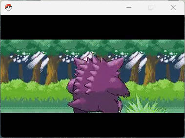

Una vez pasen los 10 segundos que dura el GIF, o si el usuario cierra la ventana, se cerrará y aparecerá la ventana del Login. En esta, tenemos dos opciones:
1. Gestor de usuarios.
2. Login.

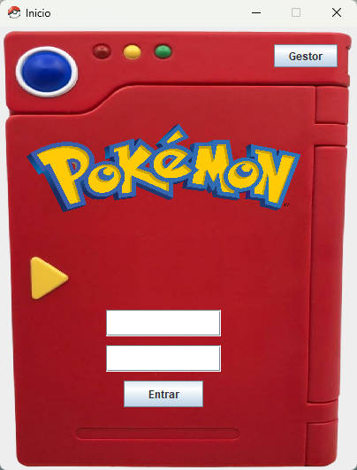

1. El botón arriba a la derecha "Gestor". Si lo pulsamos nos lleva a la ventana de confirmación de usuario Root. Aquí, el usuario tendrá que logearse como usuario root para acceder al gestor de usuarios; por el contrario, si hace click en cerrar la ventana, volverá al Login. Una vez entre, se encontrará la ventana de Gestor de usuarios: 

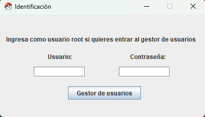

En el Gestor de usuarios habrá varias opciones:
- Eliminar usuario.
- Modificar usuario.
- Crear usuario.

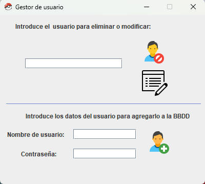

- El campo superior es para introducir el nombre de un usuario. Tenemos dos opciones una vez introduzcamos el nombre:
  - La primera busca si existe el usuario y, si lo encuentra, lo elimina.
  - La segunda busca si existe el usuario y, si lo encuentra, da acceso al siguiente panel:

    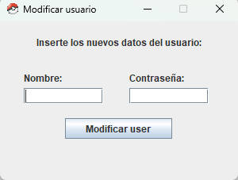

    En este panel pedirá que se intorduzca un nuevo nombre de usuario y contraseña para el usuario al que hemos accedido para actualizar. Tras darle a "Modificar user" se realizará un update con los datos introducidos a la base de datos, se cerrará la ventana y volverá al panel de gestor; si elige cerrar la ventana directamente, volverá al panel de gestor sin realizar el update a la base de datos.

- Los campos inferiores son para introducir un nombre de usuario y contraseña. Se recogerán ambos y se lanzará a la base de datos una consulta para comprobar que dicho usuario no existe. Si existe se mostrará una ventana emergente que indique que ese usuario ya existe; en caso de no existir un usuario con el mismo nombre, se creará mediante un insert a la tabla usuario con los datos recogidos.

2. Campos para introducir nombre de usuario y contraseña para logearse. Tras escribir nombre de usuario y contraseña, comprobará si existe un usuario con esos valores en la base de datos. Si no lo encuentra, saltará un mensaje que nos indique un error de credenciales; en caso contrario, encontrará al usuario y dará acceso a la siguiente ventana: La Pokédex.

    Aquí habrá varias opciones:
    - Icono de cerrar sesión arriba a la derecha.
    - Botón "Ver datos".
    - Botón "+".
    - Botón "-".
    - Botón de "Imprimir Datos".
    - Botón "Ver Equipo".

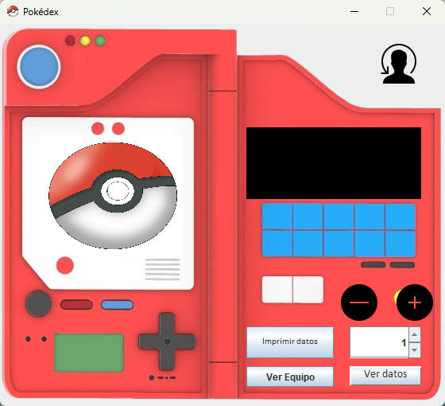

- Botón para cerrar sesión: cerrará la ventana actual y volverá a mostrar la ventana inicial del Login.
- Botón "Ver datos": recogerá el valor actual del cuadro numérico y lanzará una consulta a la base de datos para obtener el pokemon cuyo número de Pokédex sea el recogido del cuadro. Luego, mostrará en el cuadro negro la información del Pokémon y en el cuadro donde aparece una pokéball aparecerá la imagen del Pokémon.

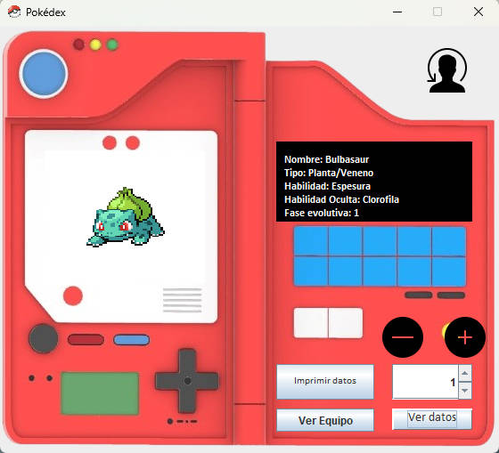

- Botón "+": este botón realizará como primera acción lo que hace el botón "Ver datos", y a continuación, agregará el Pokémon al equipo del usuario si no lo tiene. En caso de tenerlo ya en su equipo, aparecerá una ventana emergente que avisará al usuario de que ya tiene ese Pokémon.

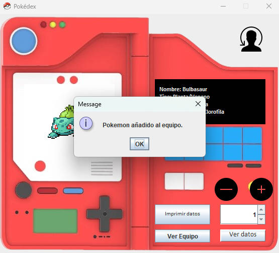

- Botón "-": este botón realizará como primera acción lo que hace el botón "Ver datos", y a continuación, eliminará al Pokémon del equipo del usuario si lo tiene. En caso de no tenerlo en su equipo, aparecerá una ventana emergente que avisará al usuario de que no tiene ese Pokémon.

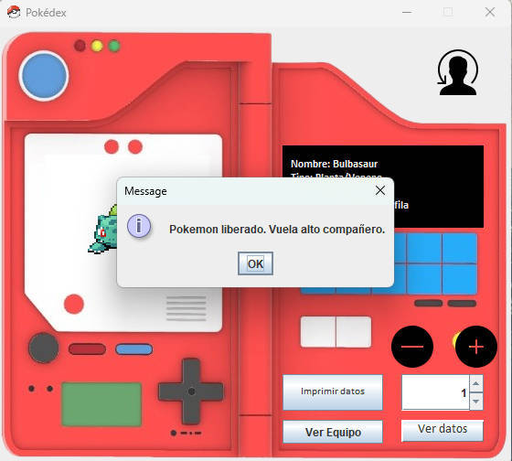

- Botón "Imprimir datos": este botón realizará como primera acción lo que hace el botón "Ver datos", y a continuación, escribirá en el fcihero DatosPokemon.md la información del mismo.

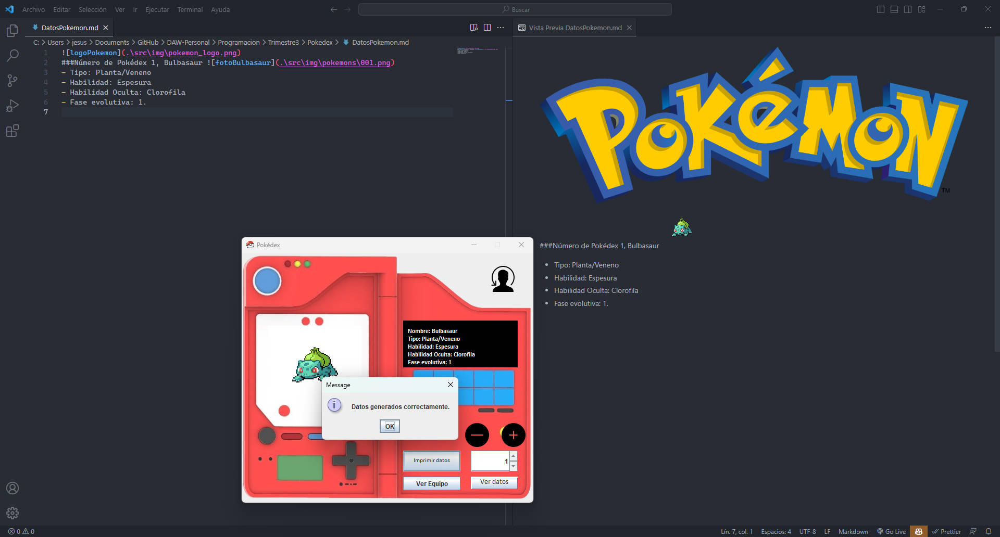

- Botón "Ver Equipo": se ocultará la ventana actual y se abrirá la ventana del Equipo Pokemon que mostrará los Pokémon que tenga el usuario actualmente. Si cerramos esta ventana, nos volverá a aparecer la ventana de la Pokédex.

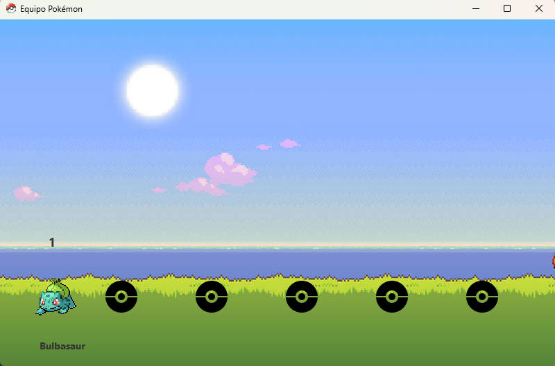

Una vez hagamos click en cerrar la ventana del Login o de la Pokédex, nos aparecerá una ventana emergente que pregunta si está seguro de cerrar la aplicación. Si el usuario hace click en "No", se cerrará la ventana emergente y se quedará en la ventana actual en la que se haya hecho click a cerrarla; en caso de hacer click en "Yes", se cerrará la ventana emergente y la ventana que estuviera abierta y aparecerá la ventana de los créditos finales:

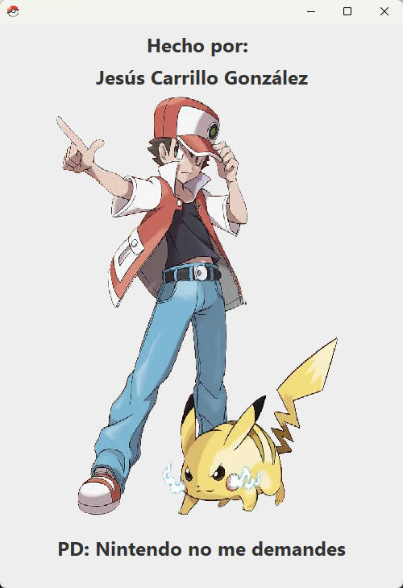
