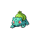
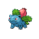
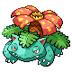

###Número de Pokédex 1, Bulbasaur 
- Tipo: Planta/Veneno
- Habilidad: Espesura
- Habilidad Oculta: Clorofila
- Fase evolutiva: 1.
###Número de Pokédex 2, Ivysaur 
- Tipo: Planta/Veneno
- Habilidad: Espesura
- Habilidad Oculta: Clorofila
- Fase evolutiva: 2.
###Número de Pokédex 3, Venusaur 
- Tipo: Planta/Veneno
- Habilidad: Espesura
- Habilidad Oculta: Clorofila
- Fase evolutiva: 3.
