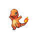
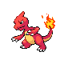
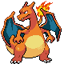

### Número de Pokédex 4, Charmander 
- Tipo: Fuego
- Habilidad: Mar Llamas
- Habilidad Oculta: Poder Solar
- Fase evolutiva: 1.

### Número de Pokédex 5, Charmeleon 
- Tipo: Fuego
- Habilidad: Mar Llamas
- Habilidad Oculta: Poder Solar
- Fase evolutiva: 2.

### Número de Pokédex 6, Charizard 
- Tipo: Fuego/Volador
- Habilidad: Mar Llamas
- Habilidad Oculta: Poder Solar
- Fase evolutiva: 3.

