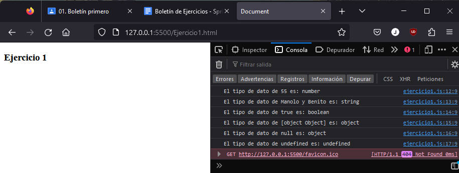
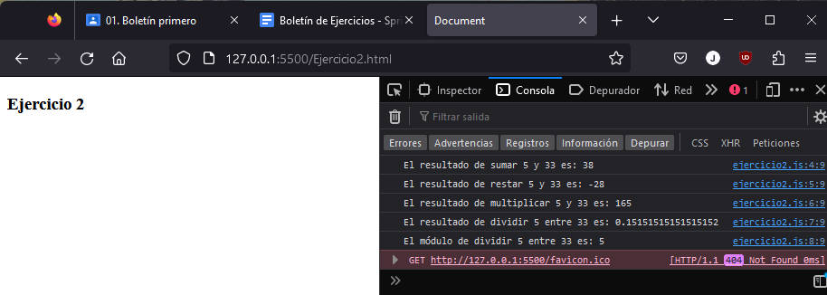
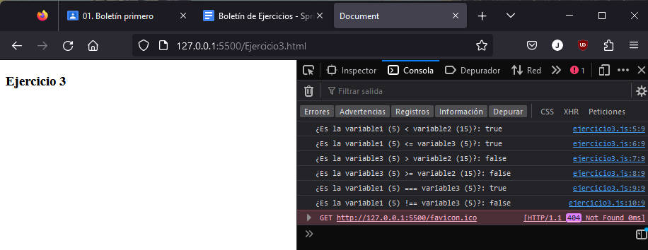
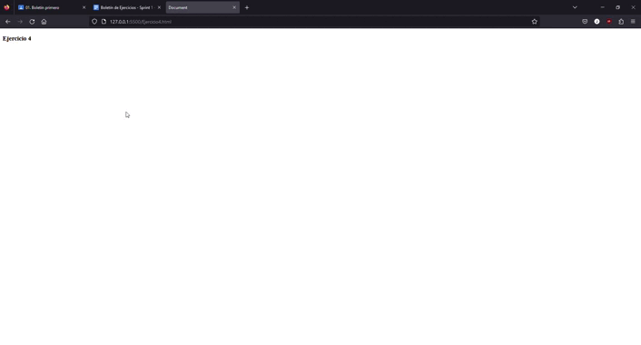
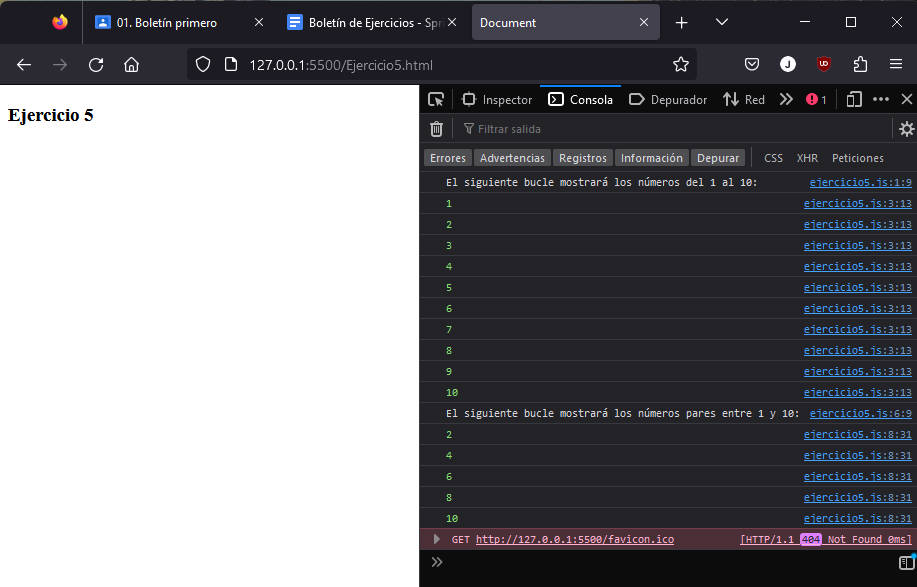

# SPRINT 1

### 🔎 Análisis del problema
Los ejercicios propuestos para este sprint 1 son los siguientes:

➡️Ejercicio 1: Declaración y Tipos de Datos
1. Declara una variable para cada tipo de dato: Number, String, Boolean, Object, Null y Undefined.
2. Utiliza console.log para mostrar el valor y el tipo de cada variable.

➡️Ejercicio 2: Operaciones Aritméticas

1. Declara dos variables numéricas.
2. Realiza y muestra en la consola las operaciones de suma, resta, multiplicación, división y módulo entre estas variables.

➡️Ejercicio 3: Comparaciones

1. Declara tres variables con diferentes valores.
2. Utiliza operadores de comparación para comparar estas variables entre sí y muestra los resultados en la consola.

➡️Ejercicio 4: Estructuras Condicionales

1. Escribir un programa que tome un número como entrada.
2. Si el número es mayor que 10, mostrar un mensaje indicando que es mayor. Si es menor, mostrar otro mensaje. Si es exactamente 10, mostrar un mensaje indicativo. (alert)

➡️Ejercicio 5: Bucles
1. Escribir un bucle que muestre en la consola los números del 1 al 10.
2. Modificar el bucle anterior para mostrar solo los números pares entre 1 y 10.

### 🖉 Diseño de la solución
Para realizar este apartado he seguido las instrucciones del enunciado apoyándome en los conocimientos de javascript y html, y en la ayuda de ChatGPT para saber cómo se hace un prompt para recoger un número en una alerta y cómo mostrar el resultado deseado en otro alert.

### 💡 Pruebas
El ejercicio 1 debería mostrar en la consola del navegador el valor de las variables definidas en el código, así como su tipo.

Enlace al archivo .js: [Ejercicio1](./ejercicio1.js)

El ejercicio 2 debería mostrar en la consola del navegador los valores de las variables que van a realizar la operación y el resultado de dicha operación.

Enlace al archivo .js: [Ejercicio2](./Ejercicio2.js)

El ejercicio 3 debería mostrar en la consola del navegador el valor de los elementos que se comparan, así como el resultado en booleano de la comparación

Enlace al archivo .js: [Ejercicio3](./Ejercicio3.js)

El ejercicio 4 debería mostrar un gif en el que aparece un alert en pantalla, en el cual se inserta un número con tres casuísticas posibles:
- El número insertado es menor de 10 por lo que al pulsar "Aceptar" sale otro alert que indica que ese número es menor que 10.
- El número insertado es 10 por lo que al pulsar "Aceptar" sale otro alert que indica que ese número es exactamente 10.
- El número insertado es mayor de 10 por lo que al pulsar "Aceptar" sale otro alert que indica que ese número es mayor que 10.

Enlace al archivo .js: [Ejercicio4](./ejercicio4.js)

El ejercicio 5 debería mostrar en la consola del navegador los números del 1 al 10 realizados por un bucle y los números pares del 1 al 10 realizados por otro bucle.

Enlace al archivo .js: [Ejercicio5](./ejercicio5.js)

