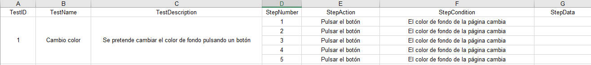
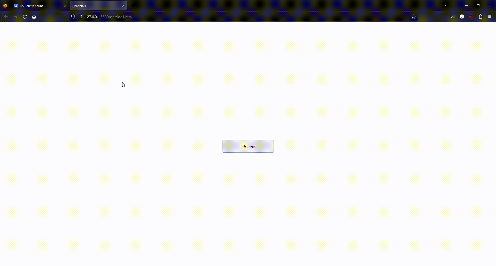
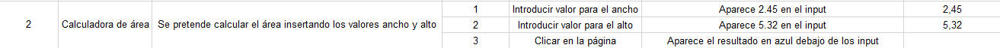
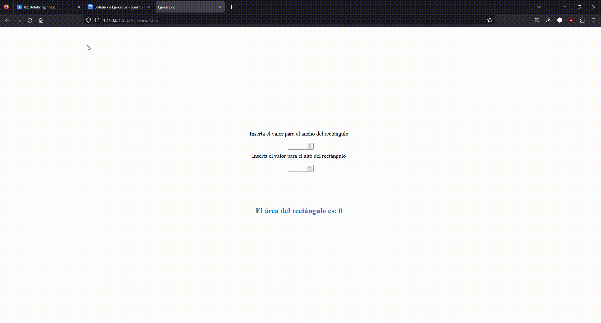
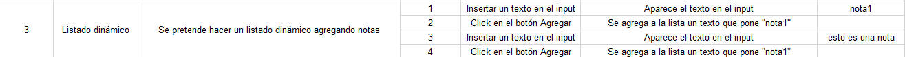
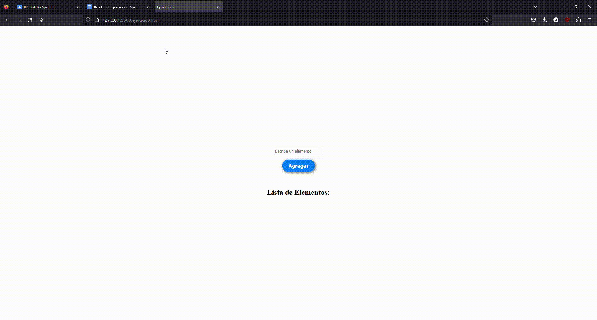
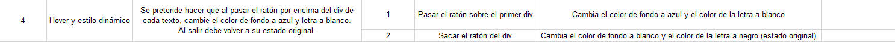
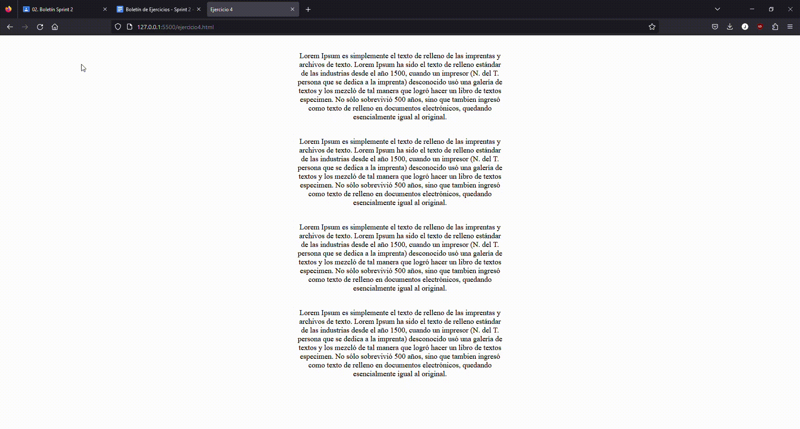
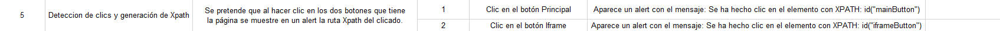
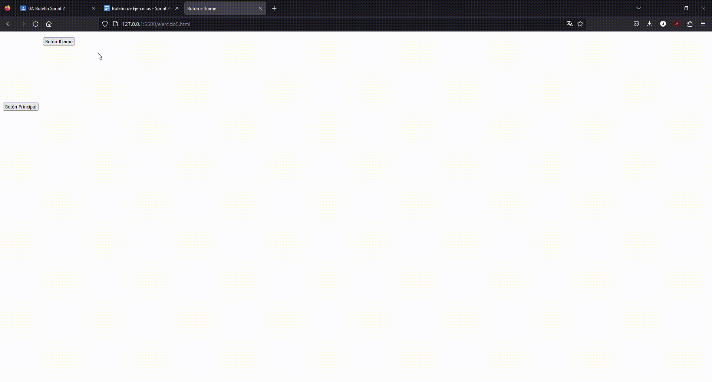

# SPRINT 2

### 🔎 Análisis del problema
Los ejercicios propuestos para este sprint 1 son los siguientes:

➡️Ejercicio 1: Cambio de Color con Botón
1. Crear una página web que contenga un botón etiquetado "Cambiar color".
2. Al hacer clic en el botón, el color de fondo de la página debe cambiar a un color aleatorio.
3. Pista: Utiliza `Math.random()` para generar valores RGB aleatorios.

➡️Ejercicio 2:  Calculadora de Área

1. Diseña una página web con dos campos de entrada (input) para introducir el ancho y el alto de un rectángulo.
2. Agrega un botón etiquetado "Calcular Área".
3. Al hacer clic en el botón, calcula el área del rectángulo y muestra el resultado en un elemento `
` en la página.
- Pista: Área del rectángulo = ancho x alto.

➡️Ejercicio 3: Listado Dinámico

1. Crea una página con un campo de entrada y un botón etiquetado "Añadir a la lista".
2. También debes tener una lista vacía (`<ul>` o `<ol>`).
3. Cuando el usuario escribe algo en el campo de entrada y hace clic en el botón, entonces el contenido del campo debe agregarse como un nuevo ítem (`<li>`) a la lista.
- Pista: Utiliza el método `.createElement()` y `.appendChild()` del DOM.

➡️Ejercicio 4: Hover y Estilo Dinámico

1. Diseña una página con varios elementos div, cada uno con un texto diferente.
2. Al pasar el ratón sobre un div, cambia su color de fondo a azul y el texto a blanco.
3. Al mover el ratón fuera del div, restaura sus estilos originales.
- Pista: Considera usar eventos como "mouseover" y "mouseout".

➡️Ejercicio 5: Detección de Clics y Generación de XPath

Desarrolla una página web que, al hacer clic en cualquier elemento, muestre el XPath único de ese elemento en un cuadro de alerta o en una sección dedicada de la página.
Especificaciones:
1. Detección de Clics:
   - Añade un evento de escucha a todo el documento (`document`) para detectar cualquier clic realizado.
   - Al detectar un clic, determina el elemento exacto que fue clickeado usando el objeto `event.target`.
2. Generación de XPath:
   - Una vez identificado el elemento, genera su XPath.
- Muestra el XPath generado en un cuadro de alerta o en una sección específica de la página.

### 🖉 Diseño de la solución
Para realizar este apartado he seguido las instrucciones del enunciado apoyándome en los conocimientos de javascript y html, y en la ayuda de ChatGPT, en el cual me he tenido que apoyar para realizar los ejercicios, especialmente la parte de identificar el botón que está dentro del iframe en el ejercicio 5.

### 💡 Pruebas
#### Plan de pruebas ejercicio 1:

Enlace al archivo .js: [Ejercicio1](./ejercicio1.js)

#### Plan de pruebas ejercicio 2:

Enlace al archivo .js: [Ejercicio2](./ejercicio2.js)

#### Plan de pruebas ejercicio 3:

Enlace al archivo .js: [Ejercicio3](./ejercicio3.js)

#### Plan de pruebas ejercicio 4:

Enlace al archivo .js: [Ejercicio4](./ejercicio4.js)

#### Plan de pruebas ejercicio 5:

Enlace al archivo .js: [Ejercicio5](./ejercicio5.js)