# SPRINT 3

### 🔎 Análisis del problema
Los ejercicios propuestos para este sprint 1 son los siguientes:

➡️Ejercicio 1: Filtrado de propiedades de un objeto

Dado un objeto y una lista de propiedades, escribe una función que devuelva un nuevo objeto solo con las propiedades indicadas.

➡️Ejercicio 2:  Transposición de matrices

Dada una matriz, escribe una función que devuelva la transposición de esa matriz.

➡️Ejercicio 3: Dada una matriz, escribe una función que devuelva la transposición de esa matriz.

Dado dos objetos, escribe una función que los fusiona en uno solo. Si hay propiedades repetidas, conserva el valor del segundo objeto.

➡️Ejercicio 4: Cadena más larga en un array

Escribe una función que, dado un array de cadenas, devuelva la cadena más larga y su longitud.

➡️Ejercicio 5: Ordenamiento interactivo de tabla de personas

Dada una tabla de personas con las columnas "Nombre", "Edad", "DNI", "Tiene/No tiene hijos" y "Fecha de nacimiento", escribe una función que permita ordenar la tabla por cualquiera de esas columnas. La columna "Fecha de nacimiento" debe tener el formato DD/MM/AAAA.
Puntos a tener en cuenta:
- Se debe generar la tabla en HTML a partir del array de ejemplo pero con 20 filas en total (hay que añadir 15 más al ejemplo)
- Al hacer un primer click sobre la clave de la columna, por ejemplo, Nombre, las filas se ordenaran de manera descendente (Z-A).
- Al hacer un segundo click sobre la clave de la columna, por ejemplo, Nombre, las filas se ordenaran de manera ascendente (A-Z).
- Debe mantener la relación de las filas, es decir, no se ordena sólo la columna, sino la fila completa.

➡️Ejercicio 6: Análisis y Transformación Avanzada de Datos

Dado un conjunto de datos en forma de array con información sobre estudiantes, sus calificaciones en diferentes asignaturas y detalles adicionales, implementa funciones para analizar, filtrar y transformar estos datos.
1. Estudiantes Destacados por Asignatura:
Crea una función que, dada una asignatura, retorne los 3 estudiantes con las mejores notas en esa asignatura.
2. Asignatura con Menor Rendimiento:
Diseña una función que identifique la asignatura en la que los estudiantes tienen, en promedio, la menor calificación.
3. Mejora de Notas para Estudiantes con Beca:
Escribe una función que aumente todas las notas de los estudiantes con beca en un 10% (sin superar el máximo de 10).
4. Filtrado por Ciudad y Asignatura:
Crea una función que, dada una ciudad y una asignatura, retorne la lista de estudiantes de esa ciudad ordenados descendentemente por la nota de la asignatura dada.
5. Estudiantes Sin Beca por Ciudad:
Escribe una función que, dada una ciudad, retorne la cantidad de estudiantes que no tienen beca en esa ciudad.
6. Promedio de Edad de Estudiantes con Beca:
Diseña una función que calcule el promedio de edad de los estudiantes que tienen beca.
7. Mejores Estudiantes en Total:
Crea una función que devuelva un array con los 2 estudiantes que tengan el mayor promedio general entre todas las asignaturas.
8. Estudiantes con Todas las Materias Aprobadas:
Diseña una función que retorne un array con los nombres de los estudiantes que hayan aprobado todas las materias (considera aprobado con una calificación mayor o igual a 5).

### 🖉 Diseño de la solución
Para realizar los diferentes ejercicios propuestos he seguido las instrucciones del enunciado apoyándome en los conocimientos de javascript, html y ChatGPT, el cual me ha ayudado a realizar especialmente los ejercicios 5 (para hacer las ordenaciones de la tabla por las diferentes columnas) y algo en las funciones del ejercicio 6.

### 💡 Pruebas
#### Plan de pruebas ejercicio 1:

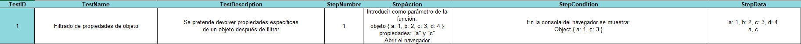

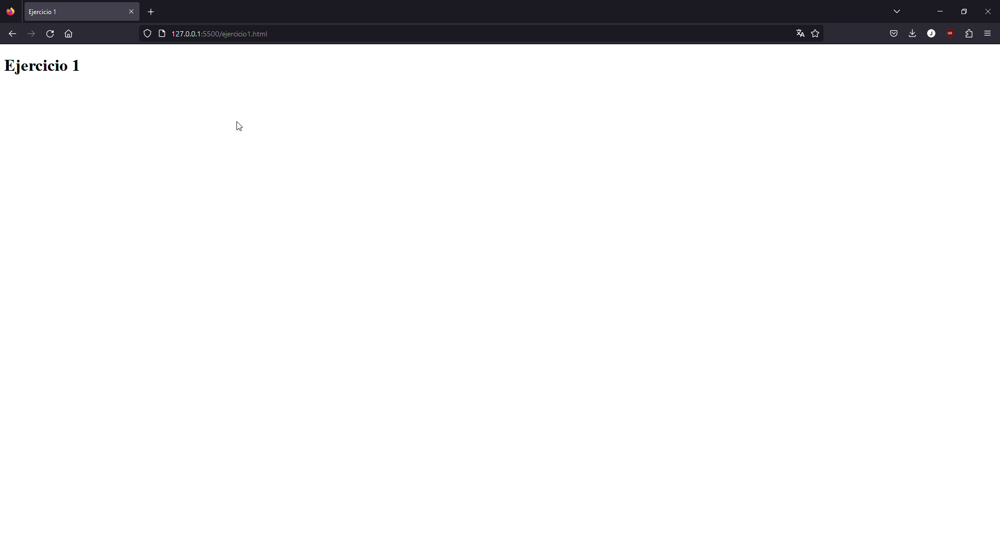

Enlace al archivo .js: [Ejercicio1](./ejercicio1.js)

#### Plan de pruebas ejercicio 2:

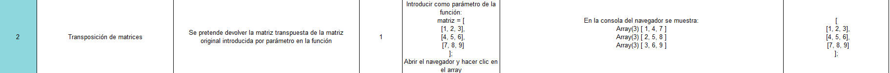

Enlace al archivo .js: [Ejercicio2](./ejercicio2.js)

#### Plan de pruebas ejercicio 3:

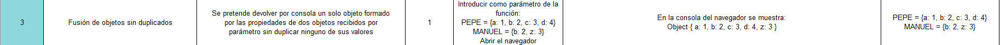

Enlace al archivo .js: [Ejercicio3](./ejercicio3.js)

#### Plan de pruebas ejercicio 4:

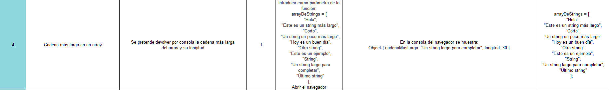

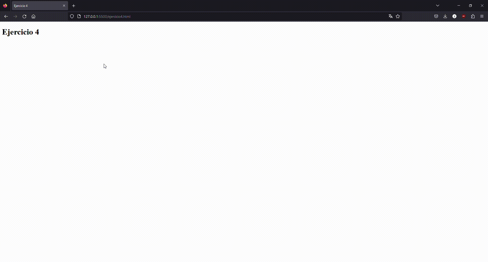

Enlace al archivo .js: [Ejercicio4](./ejercicio4.js)

#### Plan de pruebas ejercicio 5:

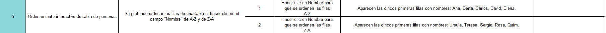

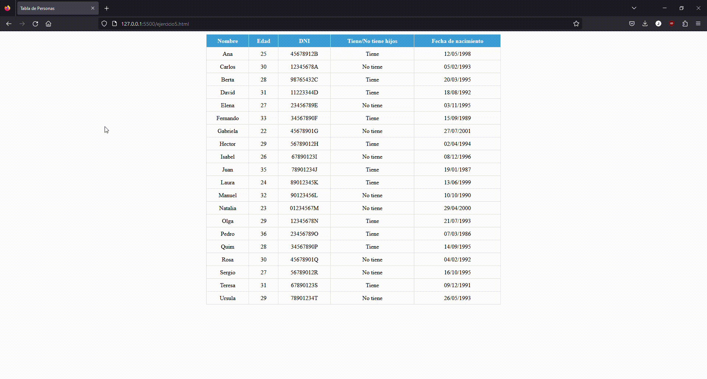

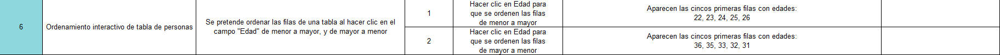

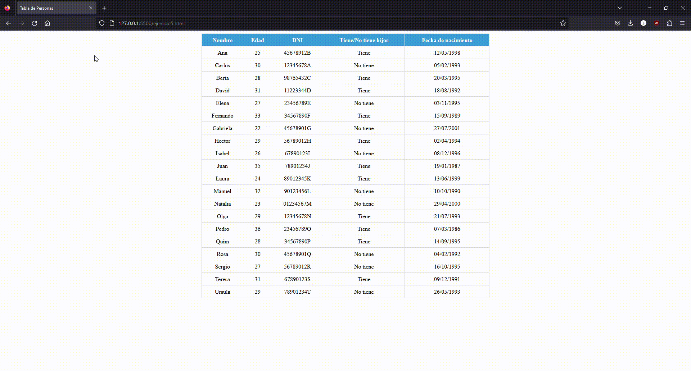

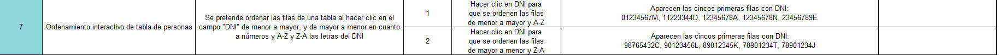

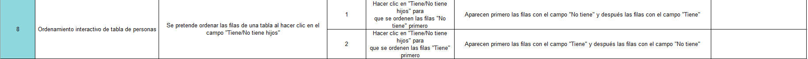

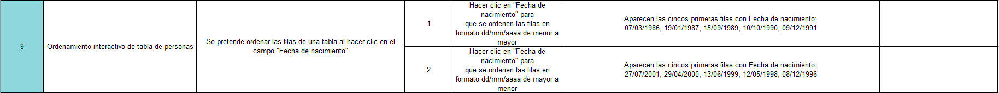

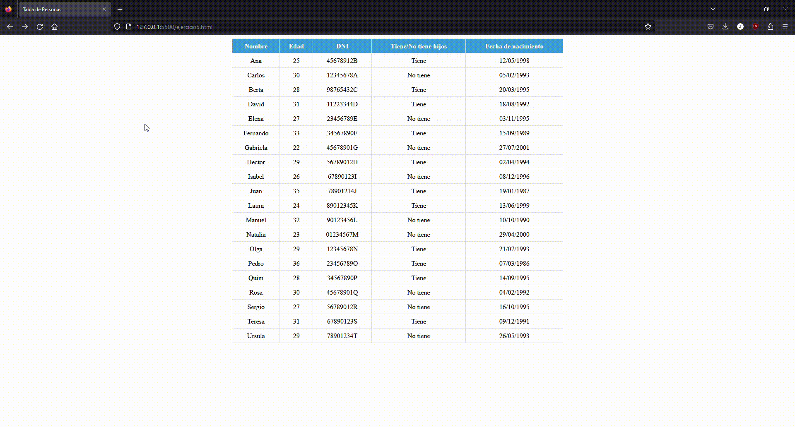

Enlace al archivo .js: [Ejercicio5](./ejercicio5.js)

#### Plan de pruebas ejercicio 6:
Para este ejercicio se utilizaré en todas las funciones el siguiente array de datos:

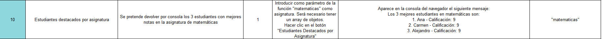

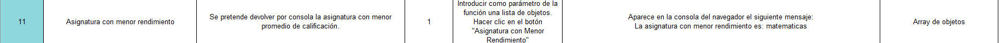

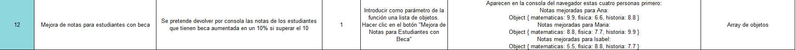

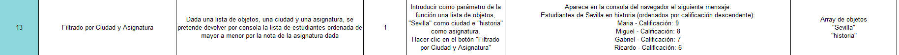

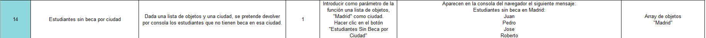

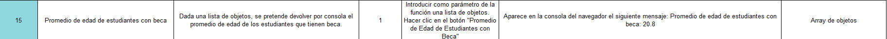

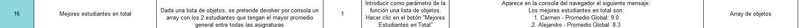

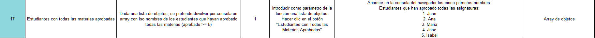

Enlace al archivo .js: [Ejercicio6](./ejercicio6.js)