# Carpeta para el Sprint 4

### 🔎 Análisis del problema
Los ejercicios propuestos para este sprint 1 son los siguientes:

➡️Ejercicio 1: Información básica del Pokémon

- Realizar una petición a la PokeAPI para obtener información básica de un Pokémon por su nombre.
- Mostrar el nombre, id, tipos, y una imagen del Pokémon.
- Gestionar errores de manera adecuada si el Pokémon no existe.
- Dos pruebas, una sin error probando dos búsquedas y otra con error.

➡️Ejercicio 2:  Comparativa de Pokémon

- Obtener datos de dos Pokémon elegidos por el usuario.
- Comparar sus estadísticas base (stats) y determinar cuál de ellos tiene mejores estadísticas generales.
- Presentar los resultados en una tabla comparativa de fácil lectura.
- Dos pruebas sin error.

➡️Ejercicio 3: Evoluciones y habilidades

- Dado un Pokémon específico, buscar su cadena de evolución completa.
- Listar cada una de las formas evolutivas y sus habilidades.
- Incluir un botón que permita al usuario ver más detalles de cualquier habilidad (usando un modal o una nueva vista).
- Dos pruebas, una con una cadena evolutiva y otra sin cadena evolutiva.

➡️Ejercicio 4: Explorador de películas

- Objetivo: Crear una aplicación web que permita a los usuarios explorar películas basándose en diferentes criterios como género. Usar la API The Movie DB (TMDB API)
- Interfaz de Búsqueda: Desarrollar una interfaz de usuario donde los usuarios puedan ingresar palabras clave o seleccionar filtros para buscar películas por género.
- Mostrar Resultados: Presentar los resultados de la búsqueda en un formato amigable para el usuario, mostrando detalles como el título de la película, año de lanzamiento, resumen y puntuación.
- Paginación de Resultados: Implementar la paginación para los resultados para que los usuarios puedan navegar a través de múltiples páginas de resultados.
- Dos pruebas, la primera, buscando una película, y en la segunda prueba, aplicar un filtro para que aparezca el reel relleno con paginación. (Estilo Netflix, Amazon Prime Video). Sólo un filtro a la vez.

➡️Ejercicio 5: Películas favoritas

- Objetivo: Añadir al ejercicio 4 que se puedan añadir/eliminar las película a una lista de favoritos.
- Tres pruebas:
  - Prueba 1: Añadir 10 películas a favoritos dándole a la estrellita, comprobar que aparecen las 10 películas seleccionadas.
  - Prueba 2: Eliminar la tercera y quinta película (comprobar que ya no aparecen)
  - Pruebas 3: Eliminar todas las películas y comprobar que no aparecen.

### 🖉 Diseño de la solución
Para realizar los diferentes ejercicios propuestos he seguido las instrucciones del enunciado apoyándome en los conocimientos de javascript, html y ChatGPT, el cual me ha ayudado a realizar especialmente los ejercicios 4 y 5 (mostrar adecuadamente en pantalla los elementos que se van recogiendo de las peticiones).

### 💡 Pruebas
#### Plan de pruebas ejercicio 1:
Las pruebas para el ejercicio 1 serán:
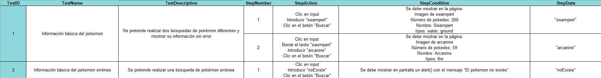

Test 1:
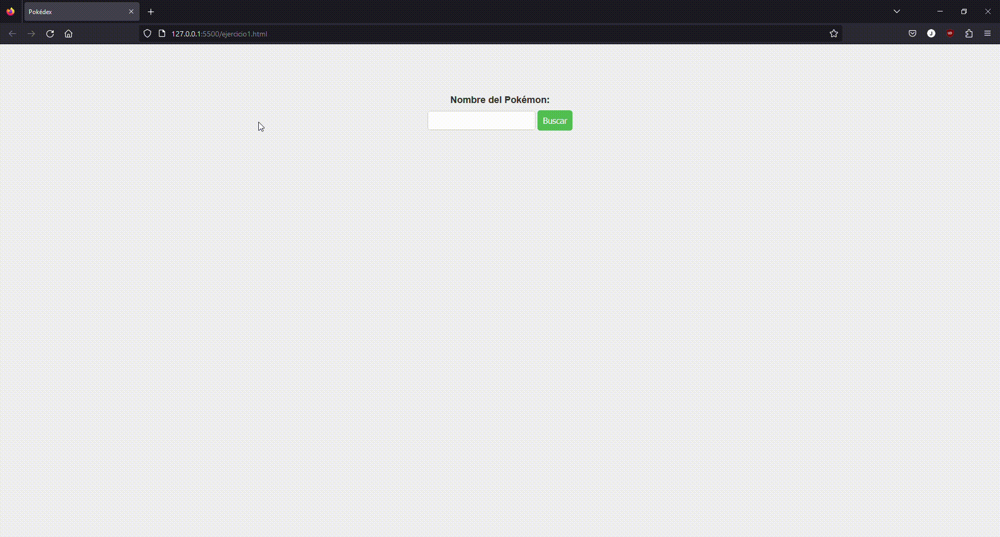

Test 2:
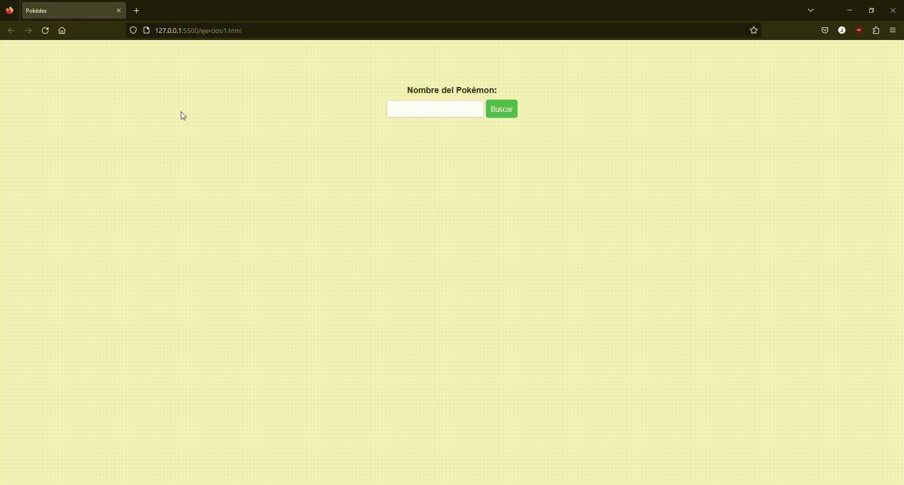

Enlace al archivo .js: [Ejercicio1](./ejercicio1/ejercicio1.js)

#### Plan de pruebas ejercicio 2:
Para este ejercicio se compara quién tiene más números stat por stat y el ganador es el que más stats tenga por encima del otro; en caso de empate (cada uno gana en 3 stats) se sumarán los números de cada stat y se dividirá entre 6 (número total de stats). El pokemon ganador será el que tenga el resultado más alto.

Las pruebas para el ejercicio 2 serán:
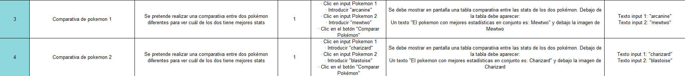

Test 1:
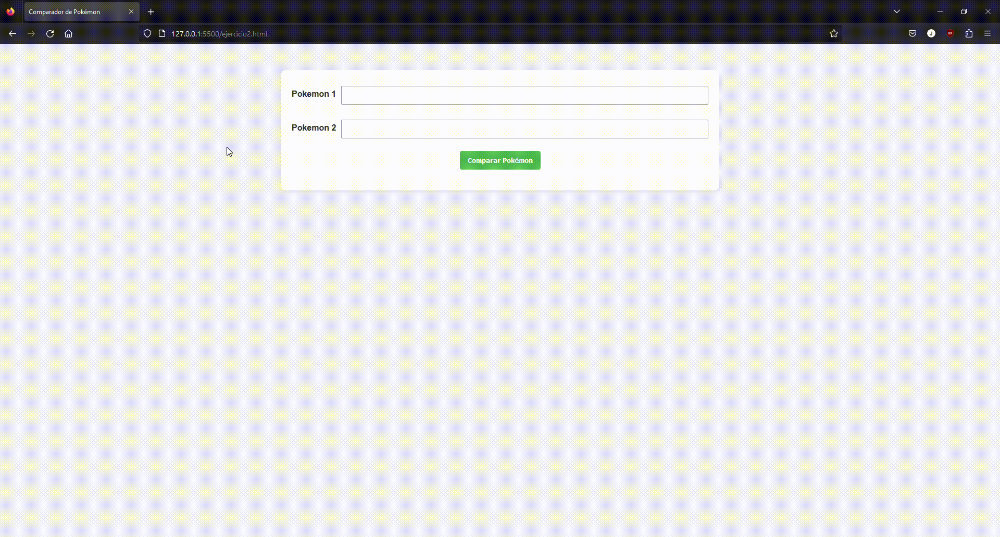

Test 2:
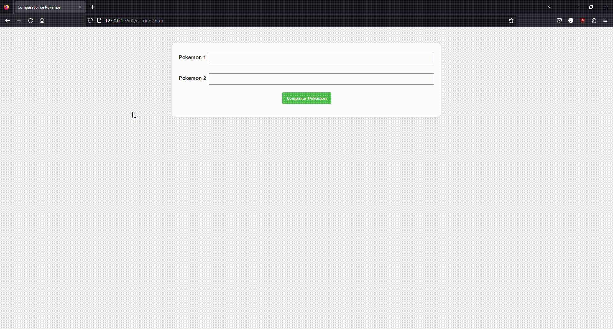

Enlace al archivo .js: [Ejercicio2](./ejercicio2/ejercicio2.js)

#### Plan de pruebas ejercicio 3:
Las pruebas para el ejercicio 3 serán:
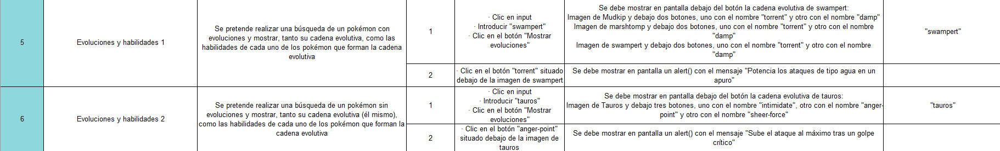

Test 1:
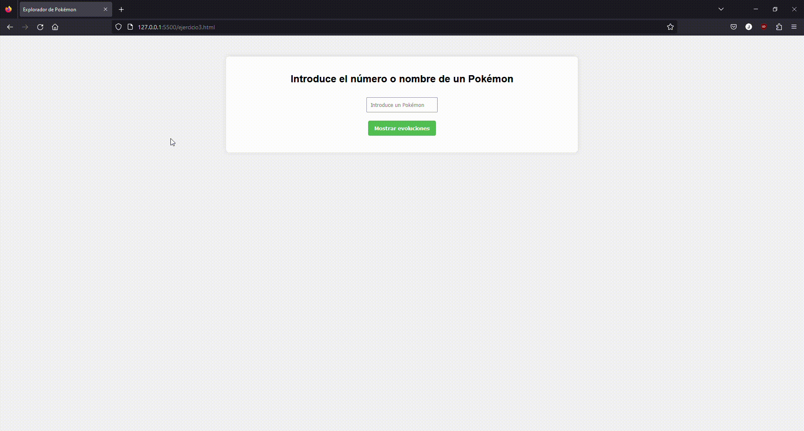

Test 2:
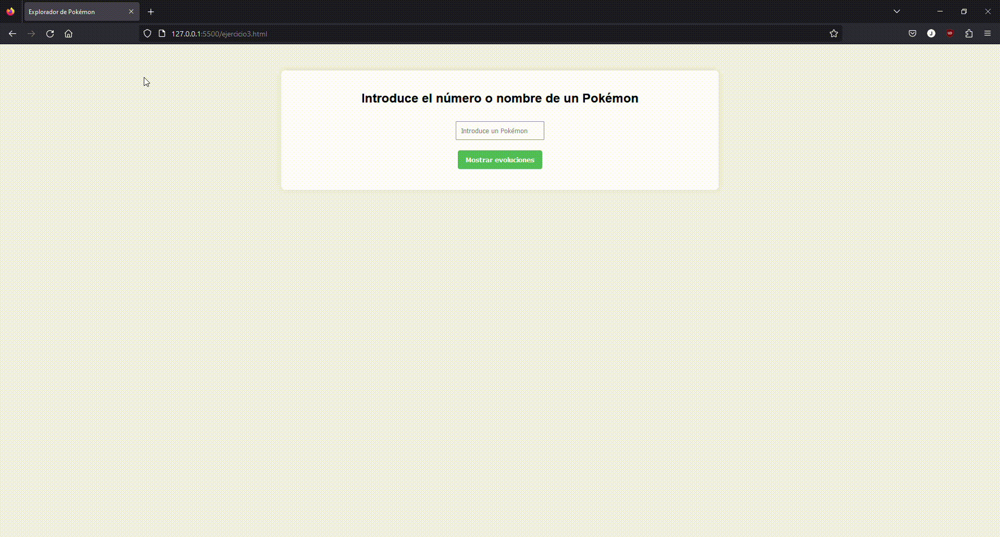

Enlace al archivo .js: [Ejercicio3](./ejercicio3/ejercicio3.js)

#### Plan de pruebas ejercicio 4:
Las pruebas para el ejercicio 4 serán:
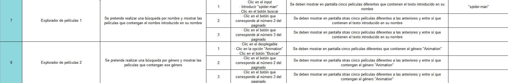

Test 1:

Test 2:

Enlace al archivo .js: [Ejercicio4](./ejercicio4/ejercicio4.js)

#### Plan de pruebas ejercicio 5:
Para realizar este ejercicio he encontrado un problema. Para realizar las peticiones POST y DELETE a la API de TMDB no se puede hacer con el session_id que te genera por defecto la cuenta, ya que solo tiene permisos de lectura. Hay que generar un session_id con permisos de escritura para poder hacer POST (insertar una película en una lista) o DELETE (borra una película de la lista); el problema lo encontramos cuando hay que generar dicho session_id, que no se puede hacer desde la propia página, sino que hay que redireccionar a una página dentro de TMDB para hacer clic en un botón que acepte dar permisos de escritura a ese usuario durante 60 minutos y ese session_id que se genera en una url, dentro de una cabecera de una petición al hacer clic en el botón de aceptar para dar permisos, no te lo puedes traer a la página por seguridad de TMDB (cors), por lo que no se pueden realizar estas peticiones de edición de datos desde nuestra propia página.

Como alternativa, he optado por crear un array vacío en mi script al que se irán insertando las películas en formato JSON con todos sus datos, donde cada película será una posición del array. Al hacer clic en el botón "Mostrar lista de favoritos" mostrará en pantalla las películas que tenga esa array, que se irá almacenando en el localStorage.

Las pruebas para el ejercicio 5 serán:
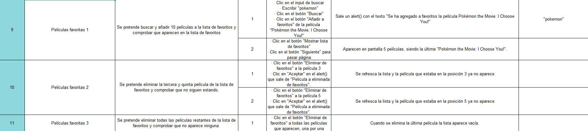

Test 1-1:

Test 1-2:

Test 2-1:

Test 2-2:

Test 3:

Enlace al archivo .js: [Ejercicio5](./ejercicio5/ejercicio5.js)