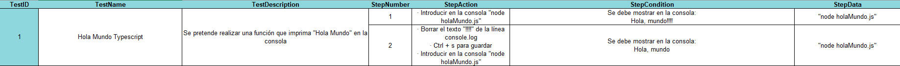
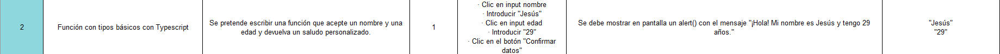
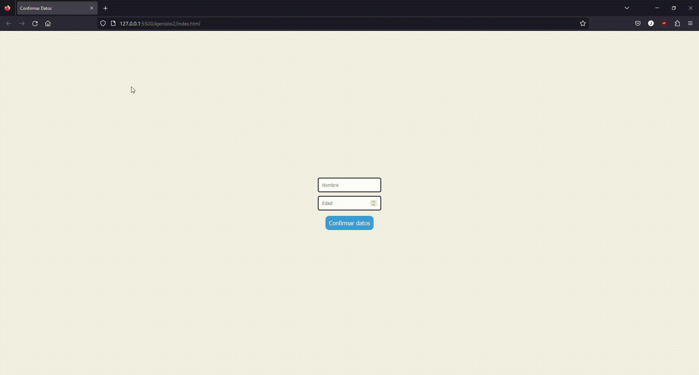
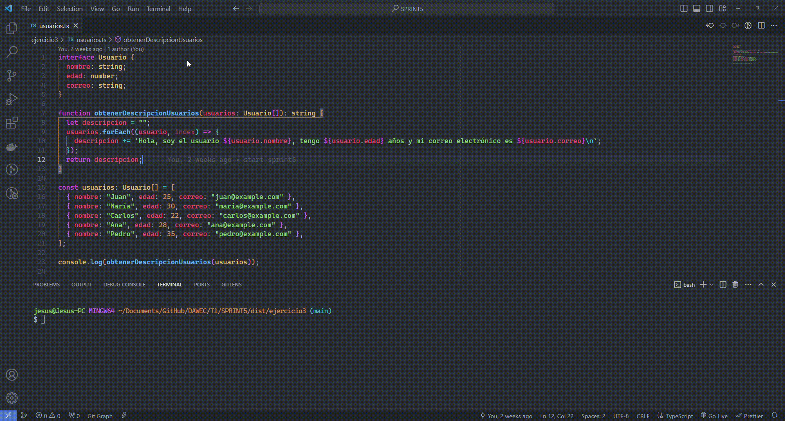
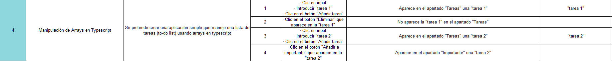
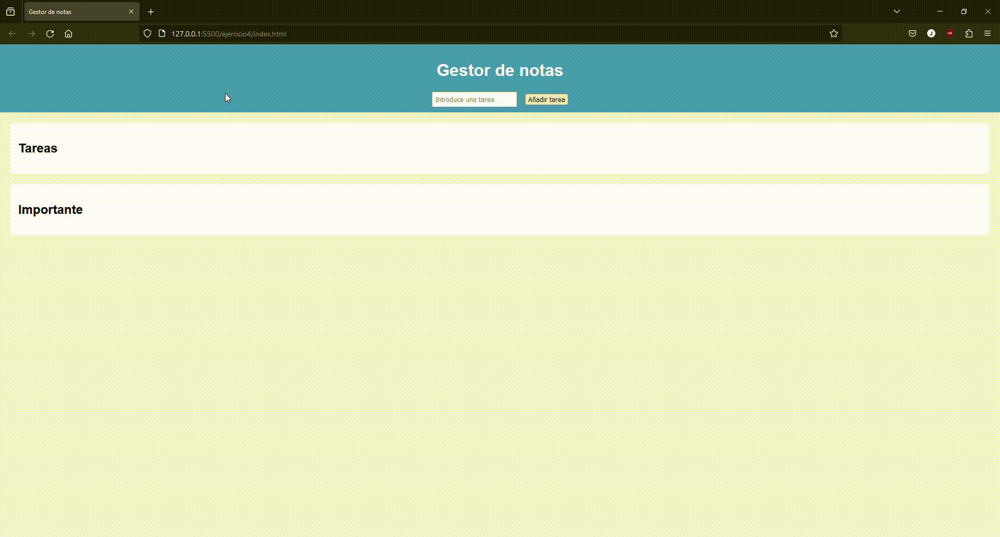
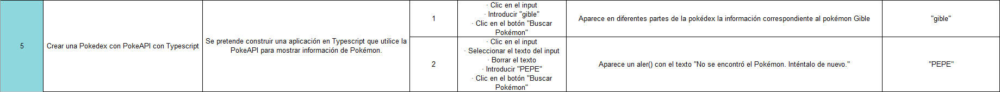
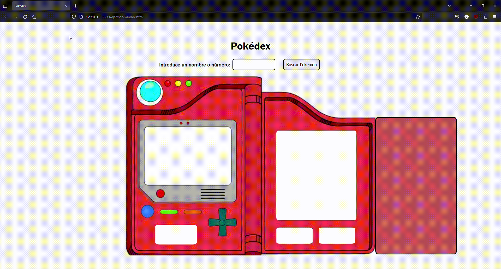

# Carpeta para el Sprint 5

## 🔎 Análisis del problema

### Comparativa entre JavaScript y TypeScript

| Característica                    | JavaScript                            | TypeScript                                 |
|------------------------------------|---------------------------------------|--------------------------------------------|
| **Tipado**                         | Dinámico y débilmente tipado.        | Estático y fuertemente tipado.             |
| **Extensión de archivos**          | .js                                   | .ts                                        |
| **Compilación**                    | No se compila, se interpreta en el navegador. | Requiere compilación antes de la ejecución. |
| **Herencia**                       | Prototípica (basada en prototipos).   | Clases y herencia de clases.                |
| **Interfaces**                     | No tiene interfaces.                  | Admite interfaces para definir contratos.   |
| **Soporte de módulos**             | A partir de ECMAScript 6 (ES6), con `import` y `export`. | Soporte nativo de módulos y namespaces.     |
| **Autocompletado y herramientas**  | Menos soporte en IDEs debido a la naturaleza dinámica. | Mayor soporte en IDEs gracias al sistema de tipos. |
| **Manejo de errores**              | Menos detección de errores en tiempo de desarrollo. | Mayor detección de errores en tiempo de compilación. |
| **Ecosistema y librerías**         | Amplio ecosistema y muchas librerías disponibles. | Compatible con el ecosistema de JavaScript y puede usar sus librerías. |
| **Adopción en proyectos**          | Muy común en proyectos web y del lado del cliente. | Se utiliza cada vez más en proyectos grandes y del lado del servidor. |
| **Curva de aprendizaje**           | Más fácil para principiantes debido a su simplicidad. | Puede tener una curva de aprendizaje más pronunciada debido a la tipificación estática. |


### Configuración del Transpilador TypeScript en Modo Watch

> [!IMPORTANT]
> En mi caso, he instalado y configurado con el SO Windows 11

#### 1. Instala TypeScript

Instalar TypeScript como dependencia de desarrollo, ejecutando el siguiente comando en la terminal:

```bash
npm install --save-dev typescript ts-node-dev
```

#### 2. Crea un archivo tsconfig.json

Puedes crear un archivo tsconfig.json en la raíz de tu proyecto. Puedes hacerlo manualmente o ejecutar el siguiente comando para generar un archivo de configuración básico:

```bash
tsc --init
```

#### 3. Edita `tsconfig.json` para Activar el Modo Watch

Abre tsconfig.json y busca la propiedad "compilerOptions". Asegúrate de que la opción "watch" esté establecida en true. Puedes ajustar otras opciones según tus necesidades. Aquí hay un ejemplo:
```
{
  "compilerOptions": {
    "target": "es6",
    "module": "es6",
    "strict": true,
    "esModuleInterop": true,
    "skipLibCheck": true,
    "forceConsistentCasingInFileNames": true,
    "outDir": "./dist",
    "rootDir": "./"
  },
  "include": ["./"],
  "exclude": ["node_modules"]
}
```
Donde:
- target: Define a qué versión de ECMAScript se compilará el código TypeScript. En este caso, se compilará a ECMAScript 6 (ES6).
- module:  Especifica el sistema de módulos a utilizar. En este caso, se está utilizando el sistema de módulos ES6.
- strict: Habilita opciones de configuración adicionales que ayudan a escribir un código más robusto y seguro.
- esModuleInterop: Permite la interoperabilidad con módulos de estilo CommonJS.
- skipLibCheck: Evita la comprobación de librerías de definiciones de tipos (archivos .d.ts).
- forceConsistentCasingInFileNames: Garantiza que los nombres de archivo tengan una consistencia de mayúsculas y minúsculas en todas las referencias.
- outDir:  Especifica el directorio de salida para los archivos JavaScript transpilados.
- rootDir: Especifica el directorio raíz donde TypeScript buscará archivos fuente para compilar.
- include: Especifica qué archivos o carpetas deberían ser incluidos en la compilación. En este caso, se incluyen todos los archivos y carpetas en la raíz del proyecto ("./").
- exclude: Especifica qué archivos o carpetas deberían ser excluidos de la compilación. En este caso, se excluyen los archivos y carpetas dentro de la carpeta node_modules.

#### 4. Editar el archivo package.json

Inlcuir en la parte de "scripts" uno como el siguiente:
```
"watch": "tsc -w"
```

#### 5. Ejecuta en la terminal

Abre la terminal en la ubicación de tu proyecto y ejecuta el siguiente comando:

```bash
npm run watch
```

Este comando transpilará automáticamente tus archivos TypeScript cada vez que guardes cambios, creando archivos .js en la capreta /dist.

----

A continuación, se detallarán los ejercicios propuestos para este sprint 5:

➡️Ejercicio 1: "Hola Mundo" en TypeScript

Objetivo: Crear un programa simple que imprima "Hola Mundo" en la consola.

Tareas:
- Instalar TypeScript y configurar el entorno de desarrollo.
- Crear un archivo holaMundo.ts.
- Escribir una función que imprima "Hola Mundo".
- Transpilar el archivo TypeScript a JavaScript y ejecutarlo.

Prueba: Hacer que ponga “Hola Mundo!!!!”, ver que transpila e imprime “Hola Mundo!!!!”. Quitar la exclamación “Hola Mundo”, ver que transpila e imprime “Hola Mundo”.

➡️Ejercicio 2: Función con Tipos Básicos con Typescript

Objetivo: Escribir una función que acepte un nombre (string) y una edad (number) y devuelva un saludo personalizado.

Tareas:
- Crear una función saludar que tome dos parámetros: nombre y edad.
- La función debe retornar un saludo que incluya ambos datos.
- Probar la función con diferentes nombres y edades.

Prueba: Hacer que se pida introducir un nombre y una edad, tras esto, tendría que salir un texto que indique “Hola! mi nombre es {{nombre}} y tengo {{edad}} años”.

➡️Ejercicio 3: Uso de Interfaces con Typescript

Objetivo: Crear una interfaz para un objeto "Usuario" y utilizarla para crear un usuario.

Tareas:
- Definir una interfaz Usuario con propiedades como nombre, edad y correo electrónico.
- Crear una función que acepte un objeto Usuario y devuelva una descripción del usuario.
- Crear varios objetos de prueba y pasarlos a la función.

Prueba: Instanciar un array de 5 Usuarios e imprimir por consola la frase “Hola! soy el usuario {{nombre}}, t

➡️Ejercicio 4: Manipulación de Arrays con Typescript

Objetivo: Crear una aplicación simple que maneje una lista de tareas (to-do list) usando arrays en TypeScript.

Tareas:
- Crear un array para almacenar tareas, cada una siendo un objeto con propiedades como id, titulo, y completada.
- Implementar funciones para añadir, eliminar y marcar tareas como completadas.
- Crear una función que muestre las tareas en la consola.

Prueba: Hay que realizar una prueba donde se realice lo mismo que en el vídeo:
- Añadir tarea a la lista de tareas
- Borrar tarea de la lista de tareas
- Añadir una tarea nueva a la lista
- Marcar esa tarea como “Importante”
- Ver que aparece en la lista de “Importante” y en la de tareas normal

➡️Ejercicio 5: Crear una Pokedex con PokeAPI con Typescript

Objetivo: Construir una aplicación en TypeScript que utilice la PokeAPI para mostrar información de Pokémon.

Tareas:
- Estudiar la documentación de la PokeAPI para entender cómo obtener datos de Pokémon.
- Crear una interfaz de usuario interactiva utilizando HTML/CSS.
- Implementar un campo de búsqueda donde los usuarios puedan escribir el nombre o ID de un Pokémon y obtener resultados en tiempo real.
- Diseñar una visualización atractiva de la información del Pokémon, incluyendo imágenes, tipos, estadísticas básicas, movimientos, y evoluciones.
- Manejar posibles errores, como búsquedas de Pokémon que no existen.

Prueba: Se tiene una visualización atractiva de la información del Pokémon, incluyendo imágenes, tipos, estadísticas básicas, movimientos, y evoluciones. Probar que a demás de la información, al poner el nombre de un pokemon en el buscador y este sea incorrecto (PEPE), pues aparece una pequeña animación en formato de “warning” de que ese pokemon no existe.


## 🖉 Diseño de la solución
Para realizar los diferentes ejercicios propuestos he seguido las instrucciones del enunciado apoyándome en los conocimientos de typescript, html, css y ChatGPT, el cual me ha ayudado a realizar especialmente los ejercicios 4 y 5.


## 💡 Pruebas
#### Plan de pruebas ejercicio 1:
Las pruebas para el ejercicio 1 serán:


Test:


Enlace al archivo .js: [Ejercicio1](./ejercicio1/holaMundo.ts)

#### Plan de pruebas ejercicio 2:
Las pruebas para el ejercicio 2 serán:


Test:


Enlace al archivo .js: [Ejercicio2](./ejercicio2/index.ts)

#### Plan de pruebas ejercicio 3:
Las pruebas para el ejercicio 3 serán:


Test:


Enlace al archivo .js: [Ejercicio3](./ejercicio3/usuarios.ts)

#### Plan de pruebas ejercicio 4:
Las pruebas para el ejercicio 4 serán:


Test:


Enlace al archivo .js: [Ejercicio4](./ejercicio4/index.ts)

#### Plan de pruebas ejercicio 5:
Las pruebas para el ejercicio 5 serán:


Test:


Enlace al archivo .js: [Ejercicio5](./ejercicio5/index.ts)