# Carpeta para el Sprint 1

## 🔎 Análisis del problema

### 1. Ventajas y desventajas de React y Angular

| Aspecto                      | Angular                                          | React                                        |
|------------------------------|--------------------------------------------------|----------------------------------------------|
| **Arquitectura**             | Basado en MVC, más prescriptivo                   | Basado en componentes, más flexible          |
| **Curva de aprendizaje**     | Más empinada debido a su complejidad y TypeScript | Más suave, con JSX y un modelo más simple    |
| **Gestión del Estado**       | Gestión integrada con servicios y RxJS           | Necesita bibliotecas adicionales como Redux  |
| **Rendimiento**              | Bueno, pero puede ser más lento en proyectos grandes | Generalmente rápido y eficiente           |
| **Popularidad y comunidad**  | Muy popular, comunidad grande pero menos que React | Extremadamente popular, comunidad vasta    |
| **Flexibilidad**             | Menos flexible, estructura más definida           | Muy flexible, permite distintos patrones de diseño |
| **Ecosistema y herramientas**| Completo, pero más cerrado                        | Extremamente rico y diverso                  |
| **Uso de templates**         | Usa HTML ampliado                                | Usa JSX, una mezcla de JS y HTML             |
| **Actualizaciones**         | Regulares y predecibles, pero pueden ser disruptivas | Regulares, con enfoque en la retrocompatibilidad |
| **Casos de uso ideales**     | Proyectos grandes y complejos con arquitectura en capas | Proyectos que requieren alta flexibilidad y agilidad |
| **Integración con otros servicios** | Integración estrecha con otras herramientas y bibliotecas de Angular | Fácil integración con otras bibliotecas y frameworks |
| **Gestión de dependencias**  | Gestor integrado y coherente                      | Requiere gestión manual y cuidadosa          |
| **Pruebas y Debugging**      | Herramientas integradas y potentes                | Amplias opciones, pero requiere configuración |
| **Ventajas**                 | Estructurado, robusto, ideal para grandes equipos | Flexible, amplia comunidad, ideal para proyectos rápidos |
| **Desventajas**              | Curva de aprendizaje empinada, menos flexible     | Requiere conocimiento de herramientas adicionales, menos prescriptivo |

> [!NOTE]
Sobre el formato .jsx

El formato .jsx es una extensión de sintaxis para JavaScript, utilizada principalmente con la biblioteca React de Facebook. JSX permite escribir HTML en el mismo archivo que el código JavaScript, facilitando la creación de interfaces de usuario (UI) en aplicaciones web. Aunque parece HTML, JSX es en realidad una extensión del lenguaje JavaScript.

Características clave del formato .jsx:
- Combinación de HTML y JavaScript: Permite incrustar elementos HTML directamente en el código JavaScript, lo que hace que el código sea más legible y fácil de entender, especialmente para el desarrollo de componentes de UI.
- Componentes React: JSX se utiliza para describir la apariencia de los componentes UI. Cada componente puede contener su propia lógica y estructura, encapsulando todo en un solo lugar.
- Conversión a JavaScript: Durante el proceso de compilación, el código JSX se transforma en llamadas a funciones JavaScript. Esta conversión la realiza generalmente Babel, un transpilador de JavaScript.
- Expresiones de JavaScript: Permite incrustar expresiones de JavaScript dentro del código JSX usando llaves {}. Esto es útil para manejar datos dinámicos.

> [!NOTE]
Uso de Angular vs React

Cuándo usar Angular:
- Proyectos grandes y complejos: Angular es ideal para aplicaciones empresariales grandes y complejas, especialmente aquellas que requieren una arquitectura robusta y un framework completo.
- Equipos con experiencia en TypeScript: Angular utiliza TypeScript, lo que puede ser beneficioso para equipos que prefieren un lenguaje tipado y una mayor consistencia en el código.
- Necesidad de un framework cohesivo: Angular proporciona un conjunto coherente de herramientas y prácticas. Si un proyecto necesita un ecosistema integrado y consistente, Angular es una buena opción.
- Aplicaciones con una arquitectura compleja y en capas: Angular es adecuado para proyectos que requieren una estructura bien definida y una separación clara entre el modelo, la vista y el controlador.

Cuándo usar React:
- Proyectos que requieren alta flexibilidad y agilidad: React es más ligero y ofrece más flexibilidad en términos de estructura del proyecto y selección de herramientas.
- Desarrollo rápido y aplicaciones con interfaces de usuario dinámicas: Si el proyecto implica UI interactivas y la necesidad de un desarrollo ágil, React es ideal debido a su enfoque en componentes reutilizables y su capacidad de manejar estados complejos.
- Proyectos que pueden beneficiarse de una gran comunidad: Dado que React es extremadamente popular, hay una gran comunidad y un vasto ecosistema de bibliotecas y herramientas disponibles.
- Aplicaciones que requieren una integración con diversas bibliotecas y frameworks: React se integra bien con otras bibliotecas y frameworks, lo que lo hace adecuado para proyectos que necesitan tal flexibilidad.

En resumen, la elección entre Angular y React depende del tamaño y la complejidad del proyecto, las preferencias del equipo de desarrollo, y la necesidad de flexibilidad y rapidez en el desarrollo de la interfaz de usuario. Angular ofrece un framework más estructurado y completo, mientras que React brinda mayor flexibilidad y una mejor adaptación a proyectos con interfaces de usuario dinámicas y en evolución.

A continuación, se detallarán los ejercicios propuestos para este sprint 5:

➡️Ejercicio 1: Hola Mundo en React y Componente con Props

Tareas:
- Crea un componente funcional llamado HolaMundo que simplemente renderice un elemento < h1 > con el texto "¡Hola, Mundo!".
- Renderiza este componente dentro del componente App.
- Crea un componente funcional llamado Saludo que acepte una prop nombre.
- Este componente debe renderizar un párrafo que diga "Hola, [nombre]".
- Renderiza el componente Saludo varias veces en App con diferentes nombres.

Prueba: Hacer que ponga “Hola Mundo!”, ver que se renderiza y que el componente funcione como se pide en las Tareas.

➡️Ejercicio 2: Lista de Elementos

Tareas:
- Crea un componente ListaDeFrutas que renderice una lista (< ul >) de elementos (< li >).
- El componente debe aceptar un array de frutas como prop y renderizar cada fruta en un elemento de lista. (renderizar su imagen)
- Prueba el componente con diferentes arrays de frutas.

Prueba: Hacer que aparezca la ListaDeFrutas y que se acepte un array de frutas y que se visualicen sus imágenes correspondientes. (5 tipos de frutas)

➡️Ejercicio 3: Contador de Clicks

Tareas:
- Crea un componente Contador que muestre un número (inicialmente 0) y un botón.
- Cada vez que el botón sea clickeado, el número debe incrementarse en uno.
- Implementa esto utilizando el hook useState.

Prueba: Descargar un autoclicker y usarlo para que se registren muchos clicks para una de las pruebas. Otra prueba tiene que ser con tres clicks y otra con 15 clicks.

➡️Ejercicio 4: Aplicación de Tareas

Tareas:
- Crea una aplicación de lista de tareas (ToDoApp) que permita al usuario añadir tareas, marcarlas como completadas y borrarlas.
- La aplicación debe tener un campo de texto para ingresar nuevas tareas y una lista de tareas mostradas debajo.
- Cada tarea en la lista debe tener un checkbox para marcarla como completada y un botón para eliminarla.
- Gestiona el estado de las tareas (añadir, completar, eliminar) utilizando useState.

Prueba: Haz una prueba para añadir un par de tareas, otra prueba para completar una tarea y otra prueba para eliminar la tarea restante.

➡️Ejercicio 5: Gestor de Tareas con Estados Complejos y Local Storage

Objetivo: Desarrollar una aplicación de gestión de tareas (to-do list) avanzada en React que no solo permita añadir, marcar y eliminar tareas, sino también categorizarlas y persistir los datos en el navegador usando Local Storage.

Tareas:
- Diseña una interfaz que permita al usuario introducir tareas con una categoría asociada (por ejemplo, trabajo, personal, estudio).
- Proporciona la opción de seleccionar categorías de una lista predefinida o añadir una nueva.
- Permite al usuario marcar tareas como completadas, editarlas o eliminarlas.
- Añade la funcionalidad para filtrar tareas por categoría o estado (completado, borrado).
- Uso de Local Storage para Persistencia de Datos
  - Guarda las tareas y categorías en el Local Storage del navegador para que no se pierdan al recargar la página.
  - Carga las tareas guardadas cuando la aplicación se inicia.

Consejos: Manejo Complejo del Estado
- Utiliza useState para manejar los diferentes estados de la aplicación (lista de tareas, categorías, filtro seleccionado).
- Considera la utilización de useReducer si el manejo del estado se vuelve demasiado complejo con useState.

Prueba: Genera tareas con diversas categorías. Muestra la vista filtrada de cada categoría donde sólo aparezcan esas tareas. Marca algunas como completadas, elimina una y edita otra.Recarga la página y vuelve a mirar si están las tareas guardadas o no (deberían estar).

## 🖉 Diseño de la solución
Para realizar los diferentes ejercicios propuestos he seguido las instrucciones del enunciado apoyándome en los conocimientos de html, css, React y ChatGPT, el cual me ha ayudado a realizar especialmente los ejercicios 4 y 5.

## 💡 Pruebas
#### Plan de pruebas ejercicio 1:
Las pruebas para el ejercicio 1 serán:
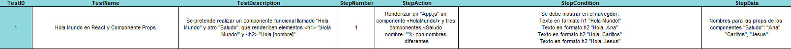

Test:
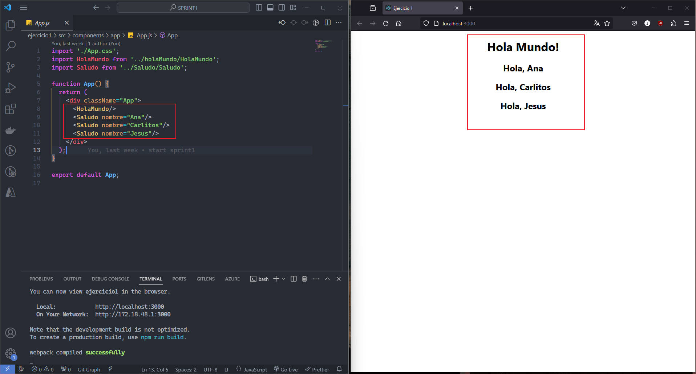

#### Plan de pruebas ejercicio 2:
Las pruebas para el ejercicio 2 serán:
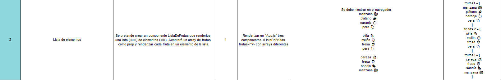

Test:
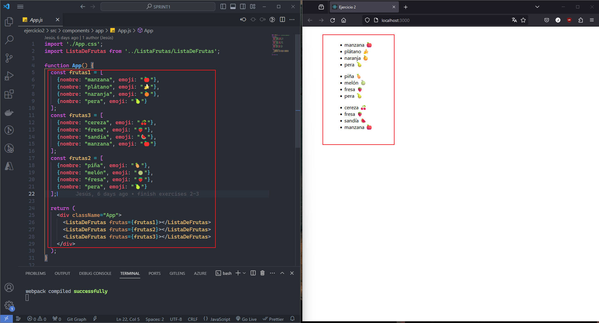

#### Plan de pruebas ejercicio 3:
Las pruebas para el ejercicio 3 serán:

Test:
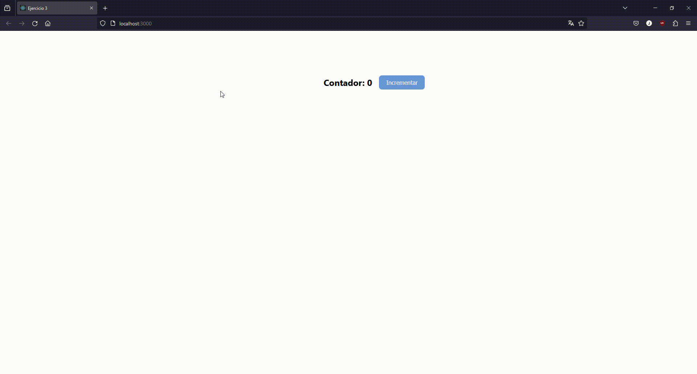

#### Plan de pruebas ejercicio 4:
Las pruebas para el ejercicio 4 serán:
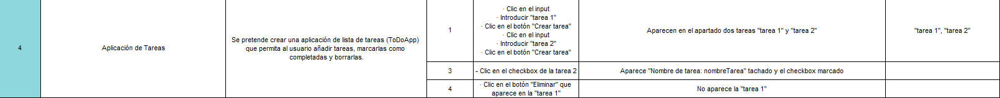

Test:
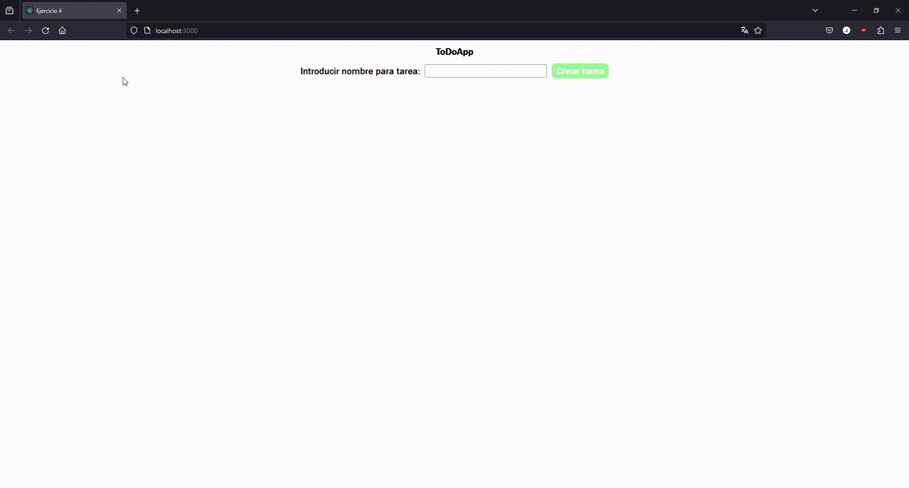

#### Plan de pruebas ejercicio 5:
Las pruebas para el ejercicio 5 serán:
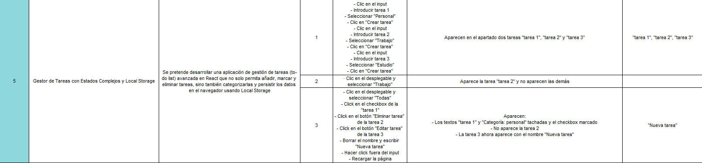

Test:
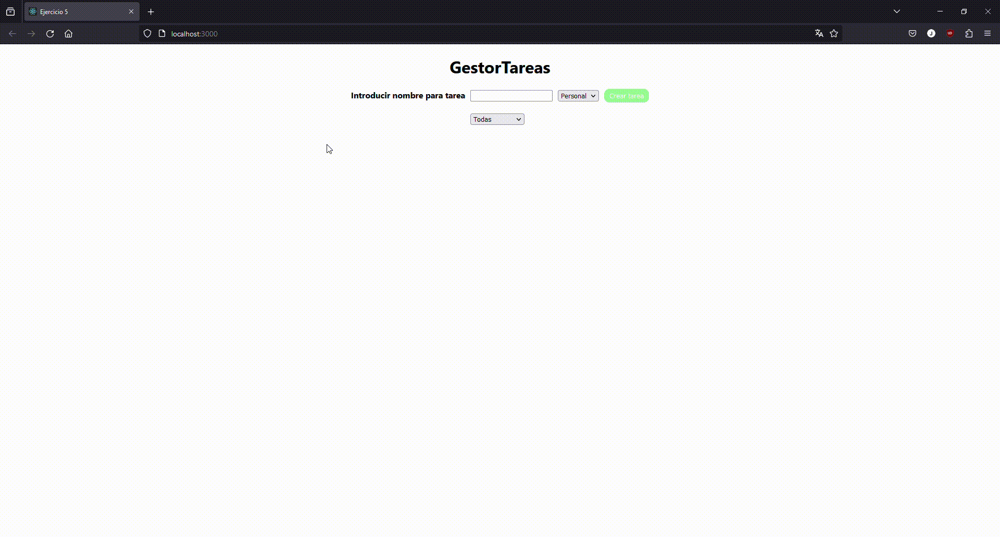
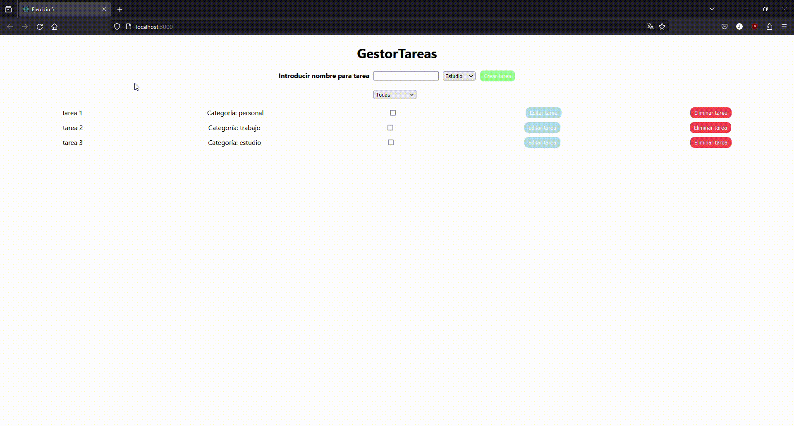
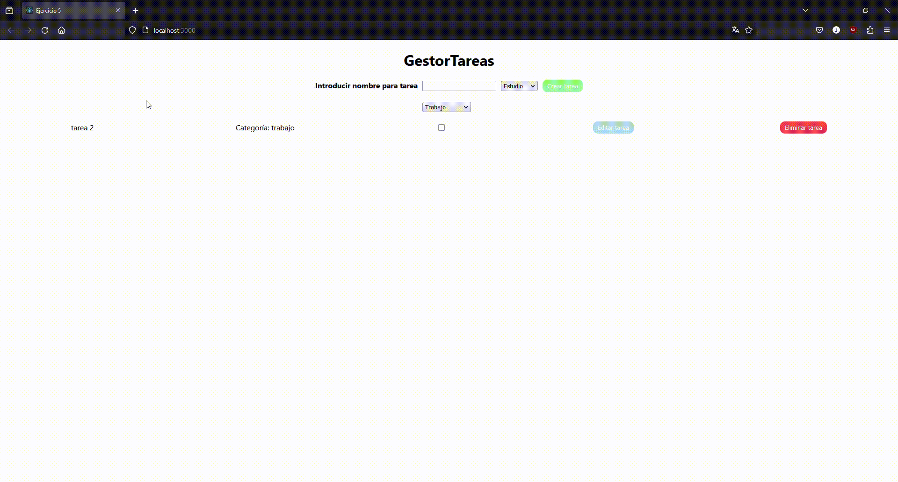