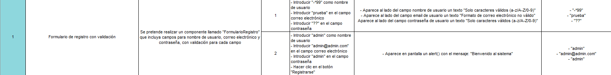
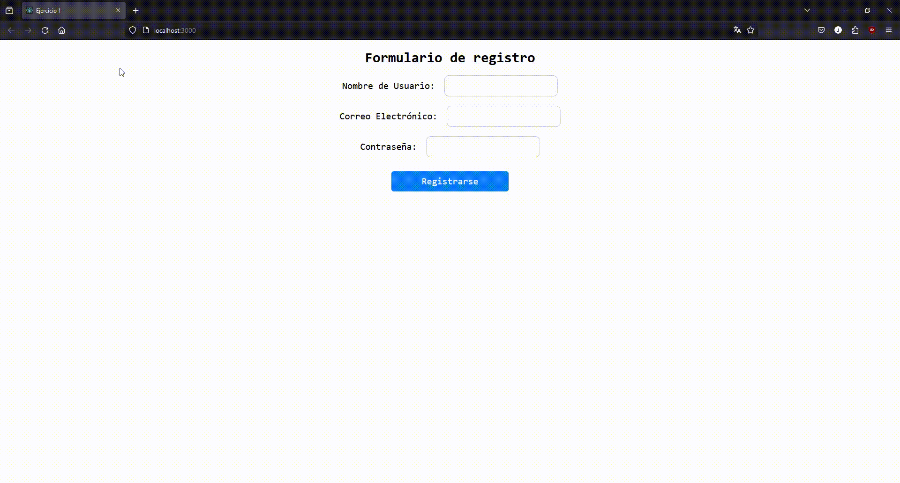
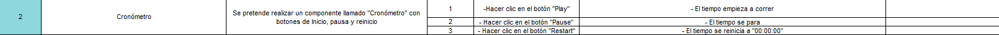
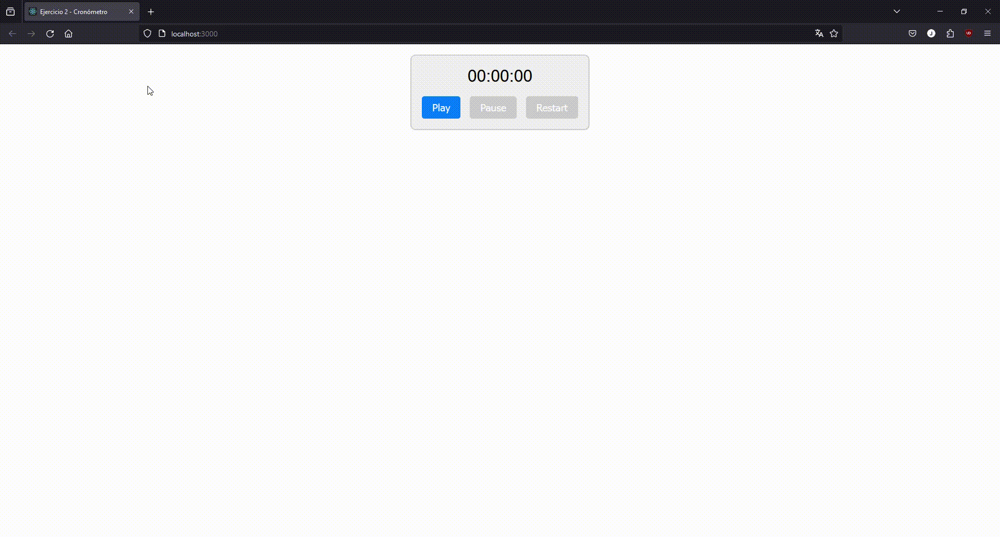
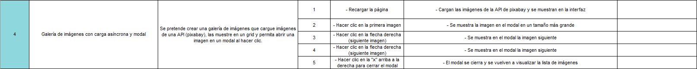
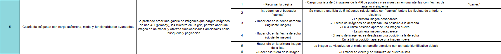
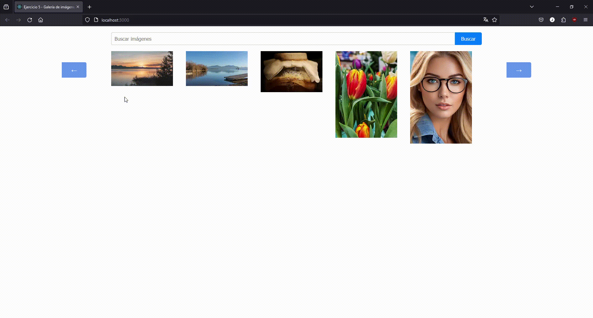

# Carpeta para el Sprint 2

## 🔎 Análisis del problema

A continuación, se detallarán los ejercicios propuestos para este sprint 2:

➡️**Ejercicio 1: formulario de Registro con Validación**

**Objetivo:** Crear un componente de clase 'FormularioRegistro' que incluya campos para el nombre de usuario, correo electrónico y contraseña, con validación de cada campo.

**Tareas:**
- Crea un componente de clase 'FormularioRegistro' con un estado que contenga valores para nombre de usuario, correo electrónico, contraseña y mensajes de error para cada campo.
- Agrega métodos para manejar los cambios en cada campo del formulario y validar los datos ingresados (por ejemplo, verificar que el correo tenga un formato válido).
- El método 'render' debe mostrar un formulario con campos para el nombre de usuario, correo electrónico, contraseña y mensajes de error correspondientes.
- Implementa estilos condicionales para mostrar los campos de texto en rojo si hay un error de validación.
- Renderiza 'FormularioRegistro' en 'App' y prueba la validación del formulario.

Prueba: Asegúrate de que el formulario valida correctamente los datos y muestra mensajes de error. Verifica que los estilos de error se aplican correctamente a los campos inválidos.

➡️**Ejercicio 2: Cronómetro con Inicio, Pausa y Reinicio**

**Objetivo:** Crear un componente de clase 'Cronometro' que funcione como un cronómetro con botones para iniciar, pausar y reiniciar el tiempo.

**Tareas:**
- Crea un componente de clase 'Cronometro' con un estado que incluya el tiempo transcurrido y si el cronómetro está activo o no.
- Implementa un método para iniciar el cronómetro que use 'setInterval' para actualizar el tiempo cada segundo.
- Agrega métodos para pausar y reiniciar el cronómetro, actualizando el estado según corresponda.
- El método 'componentWillUnmount' debe limpiar el intervalo para evitar fugas de memoria.
- El método 'render' debe mostrar el tiempo transcurrido y botones para iniciar, pausar y reiniciar el cronómetro.
- Renderiza 'Cronometro' en 'App' y prueba su funcionalidad.

Prueba: Verifica que el cronómetro inicia, pausa y se reinicia correctamente. Comprueba que al eliminar el componente del DOM, el intervalo se limpia para evitar fugas de memoria.

➡️**Ejercicio 3: Aplicación de Tareas con Filtrado y Almacenamiento Local**

**Objetivo:** Crear una aplicación de tareas ('AppTareas') que permita añadir, eliminar, filtrar tareas y almacenarlas en el almacenamiento local del navegador.

**Tareas:**
- Crea un componente de clase 'AppTareas' con un estado que incluya un arreglo de tareas, un campo de texto para nuevas tareas y un filtro de estado (todas, completadas, pendientes).
- Implementa funcionalidades para añadir nuevas tareas, marcarlas como completadas, eliminar tareas y filtrarlas según su estado.
- Usa 'componentDidMount' para cargar las tareas almacenadas en el almacenamiento local y 'componentDidUpdate' para actualizar el almacenamiento local cuando las tareas cambien.
- El método 'render' debe mostrar un formulario para nuevas tareas, botones para filtrar, y una lista de tareas que refleje el filtro seleccionado.
- Renderiza 'AppTareas' en 'App' y prueba todas las funcionalidades.

Prueba: Asegúrate de que la aplicación permite añadir, eliminar, filtrar y marcar tareas. Verifica que las tareas persisten al recargar la página.

➡️**Ejercicio 4: Galería de Imágenes con Carga Asíncrona y Modal**

**Objetivo:** Crear una galería de imágenes ('GaleriaImagenes') que cargue imágenes de una API, las muestre en un grid y permita abrir una imagen en un modal al hacer clic.

**Tareas:**
- Crea un componente de clase 'GaleriaImagenes' con un estado que incluya un arreglo de imágenes y la imagen seleccionada para el modal.
- En 'componentDidMount', realiza una petición a una API de imágenes (como Unsplash o similar) para cargar imágenes y guardarlas en el estado.
- Implementa un componente modal que se abra al hacer clic en una imagen, mostrando la imagen en tamaño completo.
- El método 'render' debe mostrar un grid de imágenes y, si una imagen está seleccionada, el modal con la imagen.
- Renderiza 'GaleriaImagenes' en 'App' y prueba la carga de imágenes y la funcionalidad del modal.

Prueba: Verifica que las imágenes se cargan correctamente desde la API y que el modal funciona al hacer clic en las imágenes. Asegúrate de que el modal se cierra adecuadamente.

➡️**Ejercicio 5: Galería de Imágenes con Carga Asíncrona, Modal y Funcionalidades Avanzadas**

**Objetivo:** Crear una galería de imágenes avanzada (GaleriaImagenesAvanzada) que cargue imágenes de una API, las muestre en un grid, permita abrir una imagen en un modal, y ofrezca funcionalidades adicionales como búsqueda y paginación.

**Tareas:**

**Componente de Clase GaleriaImagenesAvanzada:** Crea un componente con un estado que incluya un arreglo de imágenes, la imagen seleccionada para el modal, la página actual y términos de búsqueda.

**Carga Asíncrona de Imágenes:**
- En componentDidMount, realiza una petición a una API de imágenes (como Unsplash) para cargar imágenes y guardarlas en el estado.
- Implementa la paginación para cargar más imágenes cuando el usuario llegue al final del grid o mediante botones de navegación.

**Búsqueda de Imágenes:**
- Añade un campo de búsqueda para permitir a los usuarios buscar imágenes por términos específicos.
- Actualiza la galería de acuerdo a los resultados de la búsqueda.

**Componente Modal para Visualización de Imágenes:**
- Implementa un componente modal que se abra al hacer clic en una imagen, mostrando la imagen en tamaño completo.
- Añade funcionalidades al modal, como botones para navegar entre imágenes en la galería.

**Renderizado y Prueba:**
- El método render debe mostrar un campo de búsqueda, un grid de imágenes controles de paginación y, si una imagen está seleccionada, el modal con la imagen.
- Renderiza GaleriaImagenesAvanzada en App y prueba la carga de imágenes, la funcionalidad del modal, la búsqueda y la paginación.

**Prueba:**
- Verifica que las imágenes se cargan correctamente desde la API y que la paginación funciona adecuadamente.
- Asegúrate de que la búsqueda retorna resultados relevantes y actualiza el grid de imágenes.
- Comprueba que el modal se abre al hacer clic en las imágenes y permite navegar entre ellas.
- Confirma que todas las funcionalidades se integran armoniosamente y ofrecen una experiencia de usuario fluida.

## 🖉 Diseño de la solución
Para realizar los diferentes ejercicios propuestos he seguido las instrucciones del enunciado apoyándome en los conocimientos de html, css, React y ChatGPT.

## 💡 Pruebas
#### Plan de pruebas ejercicio 1:
Las pruebas para el ejercicio 1 serán:

Test:

#### Plan de pruebas ejercicio 2:
Las pruebas para el ejercicio 2 serán:

Test:

#### Plan de pruebas ejercicio 3:
Las pruebas para el ejercicio 3 serán:

Test:

#### Plan de pruebas ejercicio 4:
Las pruebas para el ejercicio 4 serán:

Test:

#### Plan de pruebas ejercicio 5:
Las pruebas para el ejercicio 5 serán:

Test:
